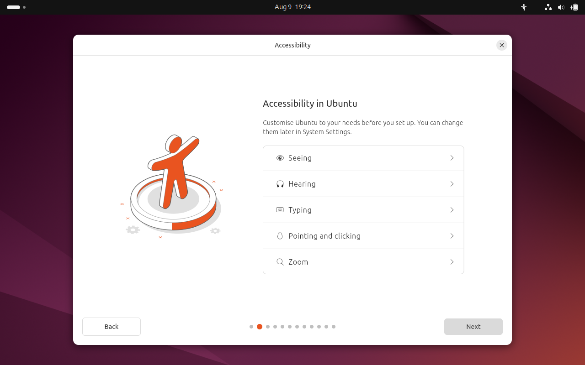
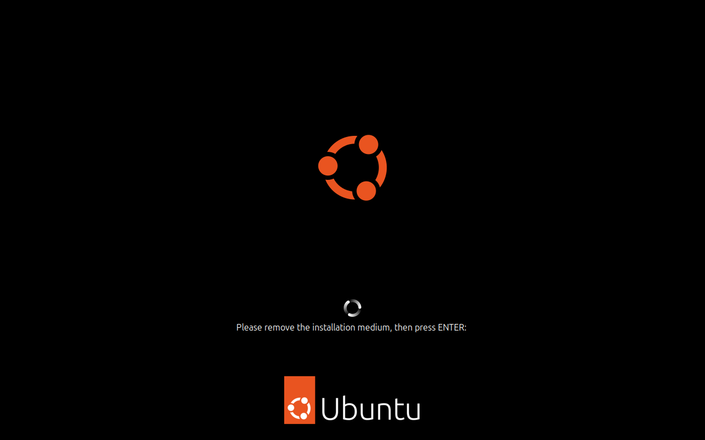

# Ubuntu Linux setup

## Outline

In this project, I will be setting up a Linux machine. I will be doing this inside Virtual Box and emulate setting up a machine for a home lab environment. If you follow these steps, by the end of this guide you will have a fucntioning Ubuntu Linux machine inside of Virtual Box.

*These guides are intended for beginners, and those with a low level of technical knowledge, so they may be able to install these machines as required.*

## Why would you need this

There are many different types of computer requirments in a modern business, and not one operating system can achieve all of these. Linux can help perform different tasks than a standard Windows operating system. Linux is also open source, meaning it is free to use, and does not require any licenseing. It is very big in the world of servers, with majority of the servers you will find in a IT environment featuring Linux operating systems. With the advent of cloud computing, there is also the need to set up environments virtualy, as you will not always be able to get your hands on the physical hardware of the machine you are working with. As Linux is opern source, it allows you to learn a lot more about how processes and sotware run on your machine, making it perfect for home lab environments, as you can learn much more about the machines you are creating.

## Before we begin

In order to run this machine in a Virtual Box environment, you will need the following:

* Oracle Virtual Box 7.1.12 install on your machine (*This is the version I used to set up this machine, so I know it works*)
* Virtualization enabled in your machines BIOS (*You can enter the BIOS configuration by pressing either ESC, DEL, F2, or F10 while you machine boots, please refer to the manafactures guide for your machine to find the correct button code*)
* An internet connection
* The ability to download files to your system (*If you are performing this task on your home machine, then this should not be an issue, however if you are performing this task on a work machine, you should always check your permissions with your IT department first*)

### Downloading the ISO

Before we begin to install this software on the machine, we must first download the software. There are many different flavours of Linux, all referred to as 'Distributions' for this project, I have chosen 'Ubuntu'. This distribution is very beginner friendly, and very powerful out of the box.

* Begin by putting 'Ubuntu' into your search engine
* Select the first link

* Select the 'Download Ubuntu' section on the navigation bar
* Select the green button marked 'Download Ubuntu Desktop'

* Select the download for the appropriate CPU architecture *In this case, it is 64bit*
* Press the green 'Download' button to begin the download

* The download will begin *Make note of where the download is being saved to. You can also fill in the news letter if you wish to remain updated about this software from the Ubuntu team*

You will notice that the file you are downloading is very large. This will take a while, and you do not want to interrupt or cancel this download, as it will corrupt the data. While this download is completing, you can begin to set up the Virtual Machine.

### Setting up the Virtual Machine
* Open Virtual Box
* Select the 'Machine' Option in the navigation bar
* Click the 'New' option to begin creating a new machine

* Name the machine
* Select the type of operating system
* Select the version of the operating system

* Select the amount of RAM for the system
* Select the number of CPU cores for the system

* Create the virtual hard disk
* Chose type of disk file

* Click finish and the machine is created

Now we have created the virtual machine, and the download the operating system, it is time to install it, following the next steps and you will have a fully functioning Ubuntu machine in Virtual Box.

### Installing the operating system

* Start your Virtual Machine

* Click the arrow to the right of the dropdown box

* Select the 'Other' option to open the file explorer

* Locate the Ubuntu file that you downloaded earlier
* Select the file, and click the open button

* Press the mount and reboot option

* Select the option to install Ubuntu once the machine has booted

* Ubuntu will now boot on your machine

* Select the 'Install' window

* Select your required language for your machine

* Select any required accessibility settings

* Select your keyboard layout, and possible variant if needed

* Connect to the internet

* Choose to install ubuntu

* Choose the interactive install

* Choose the tools to install

* If required, you can install proprietary software

* Choose how to install Ubuntu on your disk

* Enter your name
* Enter the name for your machine
* Create a username for the machine
* Create a password for the account
* Confirm that password

* Select the timezone for your machine

* Review your choices, and when you are happy, click the green install button

* The system will now begin to install

* The system has been installed, click the restart button to boot the system

* Remove the installation media

* Once the machine has booted, you will be required to log in with the password you have created

* You can seen the version of Ubuntu you have now installed

* Choose whether to enable Ubuntu Pro

* Choose to share system data with the Ubuntu team

* Finish the Ubuntu install and setup

You have now installed and set up your Ubuntu Linux machine, as you can see it is fully functional with the account you have set up on it.

You can now begin to use this machine for any projects your require a Linux machine for, or you may add it to your home lab to continue with your already in place projects

### Frequently asked questions

*How did you know which RAM and CPUs to create for the system?*

On the Ubuntu website, where you downloaded the ISO file from, there is the information for the recommend requirements for an Ubuntu system. This is the recommended hardware to have the machine function effectively, so I followed this information from the Ubuntu team

*How will I know what my password should be when I create my account?*

When creating a password, it is very important that it is a phrase that you can remember, you should also make sure that you are keeping up with all of the best password practices. This includes:

* Using a mix of lowercase and capital letters
* Using numbers
* Using symbols
* Not using easily guessable number squences *1234, your birthday, 0000 these are all bad choices to have in a password* 
