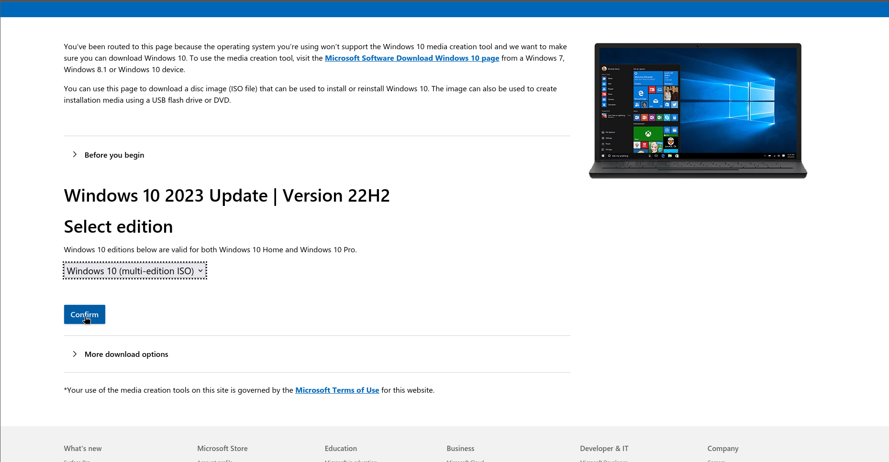
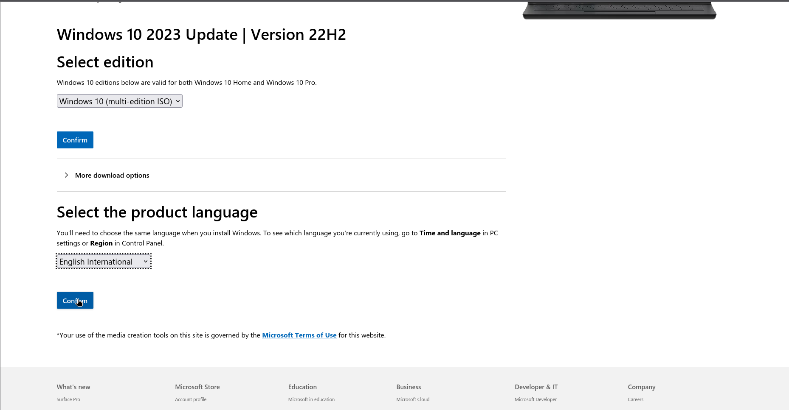
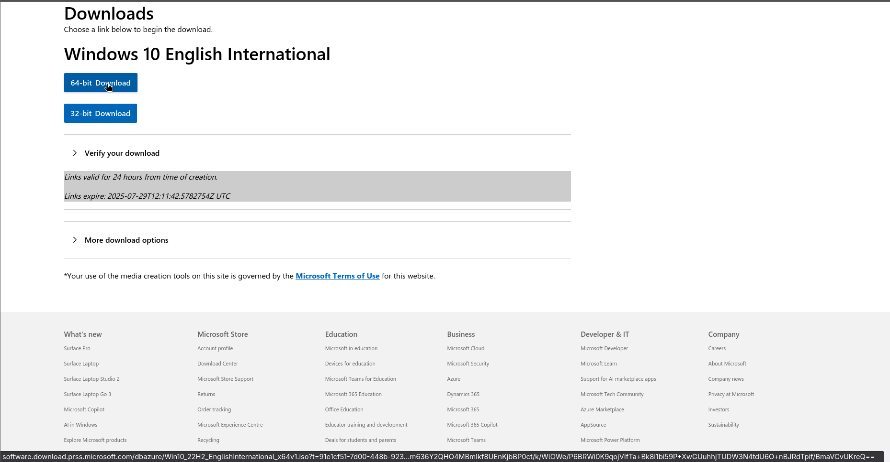
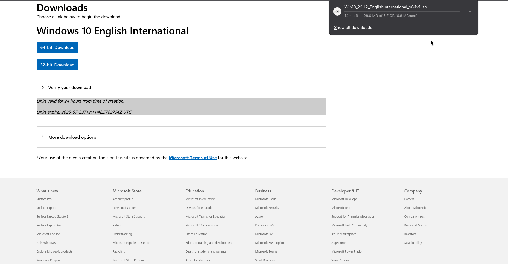
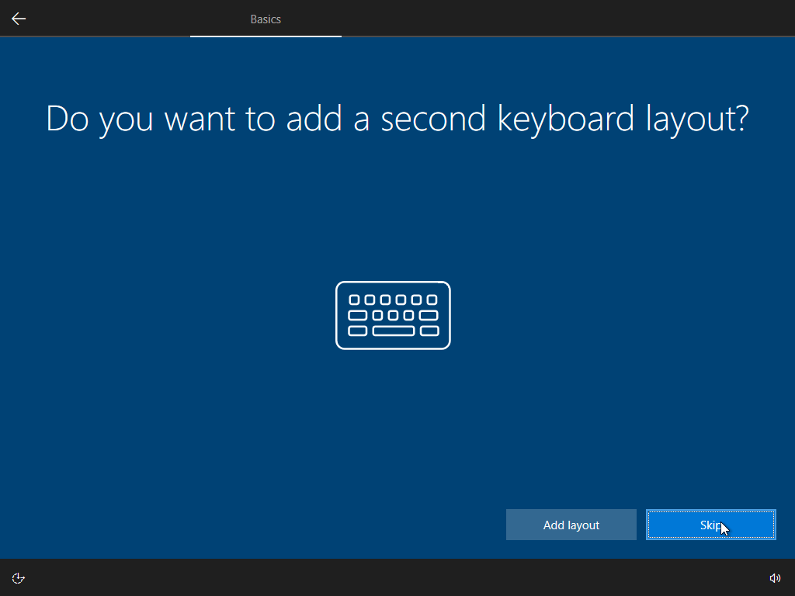

# Windows 10 machine setup

## Outline

In this guide, I will be setting up a Windows 10 machine in Virtual Box. I will go through the steps to create and install this machine, from downloading the ISO file, to creating the Virtual Machine, to how to install the operating system on the machine ready for use. With just a few alterations, you can also use this guide for setting up a physical machine.

*These guides are intended to be used by beginners or those with a low level of technical knowledge, allowing them to install these machines are required*

## Why is it important?

Setting up a Windows machine is a very common task in any IT job you may encounter, whether it be a desktop environment for a employee to use, or a Windows Server to run Active Directory for user management. I belive that given the advancements in cloud technology, it is important to learn how to setup these machines both physically and virtually, as more often than not, you will be working on machine that are hundreds of miles away from you.

## Before we begin

Before you begin to set up this machine there are some things you will require, these are as follows:

* Oracle Virtual Box 7.1.12 installed on your machine (*this is the version I use on my machine*)
* Virtualization enabled in your machines BIOS (*you can boot into the BIOS by pressing either F2, F10, ESC or DEL as your machine starts up to check this is enabled*)
* An internet connection (*this is neccesary, in order to download the Windows 10 files*)

Once you have all of these things, we are ready to get started. Our first step is to download the Windows 10 operating system, without this we will have nothing to run

### Downloading Windows 10
First, you will need to download the operating system, you can do that by following these steps:
* Search Windows 10 ISO download in your search engine

* Click the link and be taken to the download page

* Select the edition of windows 10 to download
* Select the product language you require

* Select the architecture you require (*in my case this is 64bit*)

* Your download will begin (*make sure to keep note of the location that you have downloaded the file to.*)

Operating systems are usally quite large files, as they contain the entire system you will be running on your machine, so this is going to take a while to download, we can use this time to set up our virtual machine in Virtual Box

### Setting up the Virtual Box machine

Once we have dowloaded our software, we will need to create the other most important part, a machine to run it on.

* First open Virtual box, and click the machine option in the top right corner
* Next, select New from the drop down

* Enter the name for the machine
* Select the type of Operating System and the version

* Select the amount of RAM and Processors for the system

* Create the Virtual Disk Image

### Installing the Windows 10 operating system

Now we have set up our machine and aquired our operating system, we can begin to install the OS on our machine. 

* Start your virtual machine

* Select the arrow to the right of the drop down menu
* Select the 'Other' option to open the file explorer

* Locate your Windows 10 ISO file

* Mount and reboot your virtual machine

Your machine will now boot into the Windows 10 installer, and we can bebegin to install Windows 10 on your machine.

* Select the language to install
* Select the time and currency format
* Select the keyboard input language

* Click install now

* Enter your license key

* Read and accept the terms and conditions

* Select the Custom: Install Windows only option

* Select the drive to install the Operating system on

Your system will now being installing, once this has finished the system will reboot and you will be in the operating system setup

Now that Windows has been written to the drive on your virtual machine, we can begin to set up the operating system.

* Select the region you are setting the machine up in

* Select the keyboard layout

* Choose if you need a second keyboard or not

* Choose the account to set up your system

*as I am just setting up the machine, I will choose an offline account, as I do not currently have a domain to add the machine to, or a outlook account to add to the machine.*

* Select a name for the account you are creating on the machine

* Set a password for the account (*Make sure you make note of this password*)

* Create secuirty answers for the account, should you forget the password

* Choose you preferences for advertising, data collection, and the use of Microsofts virtual assistant, Cortana

After you have completed this section, you will see the following screen

The Windows 10 operating system is now installed on your machine! your machine will now reboot, and your operating system will be functional and ready to use. This completes you creation and install of a Windows 10 machine on Vrtual Box.

### Frequently asked questions

*Can I download the Windows 10 file from another site?*

This is not recommended, as the further away you get from the source of the software when downloading, the higher the chance you have of someone tampering with it. In the interest of the system and by extension, your network remaining secure, you should only download and install software from reputable sources.

*Why have you selected 2GB of RAM and 1 CPU core when setting up this virtual machine?*

I chose these specifications, as these are the minimum requirements for the software to run on the machine. However, it is recommended that you use 4GB of RAM, and at least 2 CPU cores for a Windows 10 machine, and as you will see in my future labs, when I need to use a Windows machine to perform operations, I will always create at least this amount of virtual RAM and CPUs.

*I do not have a license code for Windows 10, can I still run the software?*

If you are using the Windows 10 software on any machine, then as part of the terms and conditions, you will be required to purchase a license to use it. You can get these discounted online, or if you buy a machine with Windows installed, you will be able to reinstall on this machine without the need to enter your license code.

*I am just seeing the Windows logo and a spinning circle when my machine has rebooted?*

This indicates that the install of you machine has been unsuccessful, the best way to remedy this is to start from the beginning and install the operating system on the machine again. There can be the occasional hang up with installing software, but a fresh install will sort these problems most of the time. 
