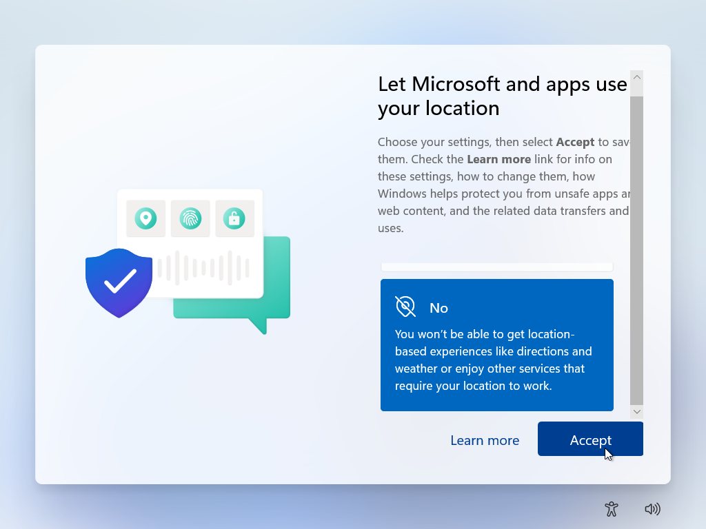
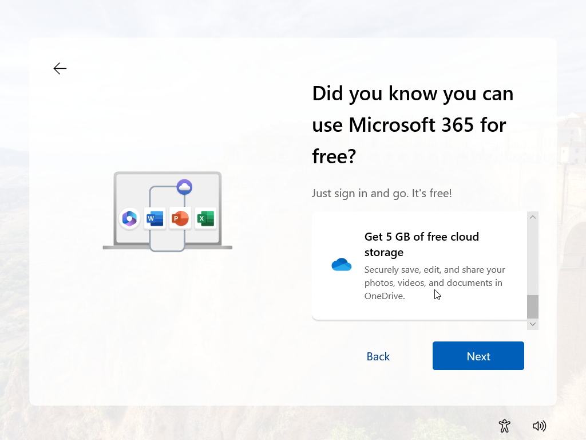

# Setting up a Windows 11 machine

## Outline 

In this guide, I will be showing you how to set up a Windows 11 machine in VirtualBox. I will guide you through downloading the ISO file, creating the virtual machine, and how to install the Windows 11 operating system on your virtual machine, and get it set up and ready to use. With just a few alterations, you can use this guide to install Windows 11 on a physical machine.

*These guides are intended for use by beginners or those with a low level of technical knowledge, allowing them to install these machines where required.*

## Why is this important

Windows machines are one of the most common types of machines you will see in IT support, and knowing how to set them up is an essential skill for any support technician. I have previously created a guide to set up a Windows 10 machine in the same environment. However, Windows 10 will reach end of support from Microsoft as of 14th October 2025, and will not be receiving security updates or patches for vulnerabilities, making any machines on your network running Windows 10 a security risk.

## Before you begin

Before you begin to set up this machine, you will need the following items:

* Oracle VirtualBox 7.2.2 installed on your machine (*This is the version I have used to create this guide*)
* Virtualization enabled on your host machine (*You can check this in your machines BIOS, which you can enter by pressing ESC, DEL, F10, F12, or F2 while your computer turns on, check your machines documentation to find out which key*)
* An internet connection (*This is required to download the ISO file*)

Once you have all these things, we can get started with creating this virtual machine.

### Downloading the Windows 11 ISO

Before we start to set up our machine, we will need to download the software to run on it, we can do that by following these steps:

* Enter 'Windows 11 ISO' into your search engine

* Click on the official Microsoft page.
* Select the edition of Windows 11 to download.

* Select the product language you require.

* Begin your software download.

Your software download will now begin.

As you can see, this download is going to take some time, so we can set up our virtual machine while it downloads.

### Setting up the VirtualBox machine

We will now need to set up our virtual machine in order to run our software on, we can do that by following these steps:

* Click on the 'New machine' option in the top left of the navigation bar.

* Name your new machine.

* Select the operating system and version you will be using.
* Select the amount of RAM and CPU cores to assign to your machine.

* Create your virtual hard disk file.

* Click finish to create your machine.

Now that we have the Operating System downloaded, we can begin to install the software on our virtual machine.

### Installing Windows 11 on our virtual machine

With the machine created, and the software downloaded, these next steps will get your software installed, and your machine up and running.

* Start the virtual machine.

* Click the arrow on the right of the file path to open the file selection drop down menu.

* Select other to open your file explorer.

* Navigate to the location you downloaded your file to.
* Select the file.
* Click open to load the file.

* Click mount and reboot to load the software to your machine.

* The machine will now boot and load the installer for your new software.
* Select the language you need for your machine.

* Select keyboard input language.

* Choose your install type (Install or repair).

* Enter your product key.

* Read and agree to the license terms.

* Select the drive to install your software on.

* Click 'Install' to begin your software installation.

The software will now go through the process of writing itself to the drive you have selected.

Once this has completed, the machine will reboot, and you can get started with setting up the machine for use.

* Select the region you will be using your machine in.

* Select your input method language.

* Select if you need a second layout or not.

* Name your device, to differ it from others on the network.

* Choose whether you would like to set this device up as a personal device(this will allow you to use the device locally) or a work or school device (this will allow you to add it to a domain).
 
* Sign in with your Microsoft account.

* Create a pin to log into your machine with.

Now you will be required to follow the next screens to set your preferences on data collection, and any paid services you may or may not wish to use with Microsoft, these are straightforward, but here are the screen shots of the preferences I chose in order to set up this machine:

After you have selected all of your preferences, your machine will now be ready to use!

### Frequently asked questions

*How did you know how much RAM and how many CPU cores to select for your machine?*

Located on the Microsoft site, the same place that we downloaded our ISO from, there is a section called 'Windows 11 device specifications'. Here it will tell you the minimum RAM and CPU cores required to run the system. I found that this machine requires at least 4GB of RAM, and at least 2 CPU cores, so I selected this for my virtual machine.

*The windows logo is just displaying after I have run the install, what should I do?*

This sounds like there has been an issue when your machine was writing the operating system to your selected drive. This could have been caused by the media being removed early, or a hiccup during the install, the best thing you can do to solve this would be to perform a reinstall of the operating system, this should solve your problem.

*I don't have a Microsoft account, can I not use Windows 11?*

You are required to have a Microsoft account in order to set up the software, but once the software is set up, you do not require one in order to use it. When you are prompted to sign in to your Microsoft account, there is a button that says 'Create one'. If you do not currently have a Microsoft account, then you can create one for the set up here. Once you have installed the operating system, you can go to 'Users & Accounts' and select the option 'Use a local account' if you wish to not have your machine associated with a Microsoft account.
